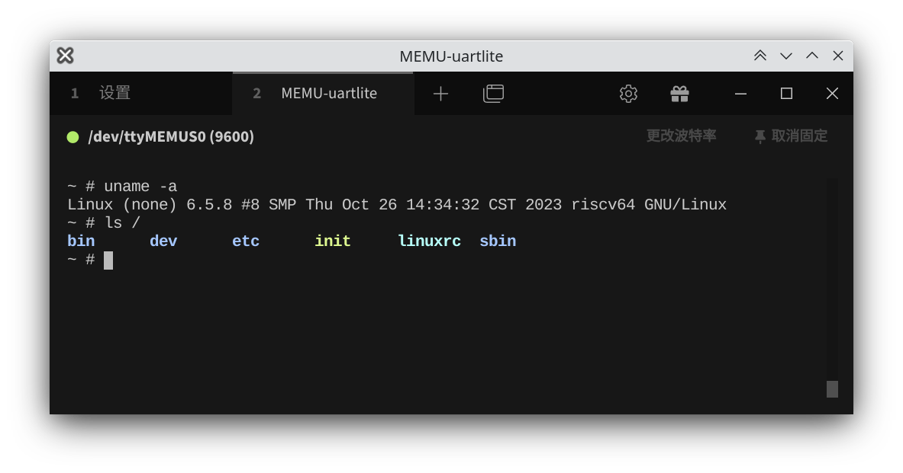

# MEMU Built-in Peripheral UART-lite



## Usage
You need a pair of virtual tty devices which route data to another. You could create one pair using `socat` command in Linux.

Here is an example approach:
```bash
socat -d -d pty,link=/dev/ttyMEMU_uartlite,raw,echo=0 \
            pty,link=/dev/ttyMEMUS0,raw,echo=0
# To workaround permission issue             
chmod 777 /dev/ttyMEMU*            
```

We use the `MEMU_UARTLITE_TTY` environment variable to specify the virtual tty device. For the example below, the `MEMU_UARTLITE_TTY` should be `/dev/ttyMEMU_uartlite`.

Here is an example approach:
```bash
export MEMU_UARTLITE_TTY=/dev/ttyMEMU_uartlite
```
Then open `/dev/ttyMEMUS0` in your serial communication program. For example minicom:
```bash
minicom -D /dev/ttyMEMUS0
```
You could also use other serial terminal client or serial debugger tools, for example, tabby. Any baud rate is OK if required. 

